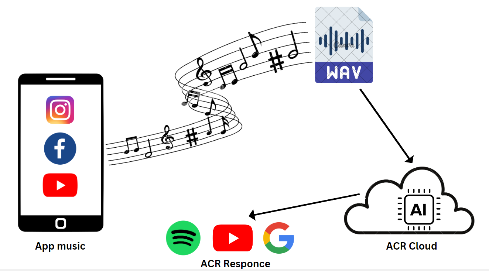

# Melodex: Identify Songs with Ease

## Navigation

- [Overview](#overview)
- [Features](#features)
- [Usage](#usage)
- [Project Flow](#project-flow)
- [Installation](#installation)
- [Found a Bug or Want to Contribute?](#found-a-bug-or-want-to-contribute)
- [Show Your Support](#show-your-support)
- [License](#license)
- [Contact](#contact)

## Overview
MeloDex is an android app that functions by capturing and analyzing internal audio from various applications such as Instagram reels and YouTube shorts. 
It effectively identifies the audio being played and offers convenient links to Spotify, YouTube, and the web for further exploration.

## Features
- **Song Recognition:** Identify songs by capturing audio samples.
- **Integration:** Utilizes the ACR Cloud API for accurate music recognition.
- **Service:** Runs a foreground service for continuous song identification.
- **Quick Links:** Provides a quick link to search for recognized songs on Google, Youtube, and Spotify.
- **User Interface:** Simple and intuitive interface for easy interaction.

## Usage

1. **Grant Permissions:** Ensure Melodex has the necessary permissions for audio and overlay access on your device.
2. **Initiate Song Recognition:**
   - Tap the "Allow Casting" button to start the song recognition process.
   - Play the reel/short on Instagram or YouTube.
3. **Capture Audio Samples:**
   - Click on the play button to allow Melodex to capture audio samples.
   - Let the audio play for a few seconds.
4. **Identify the Song:** Click on the pause button to stop capturing audio and identify the song.
5. **Explore Recognized Song Details:** Once the song is identified, view it on Google, Spotify, or YouTube using the provided links, wherever it is available.
app/src/main
## Architecture Overview



## Project Flow
1. **Initiate Audio Recording:** Commence the audio recording process to capture the target song.
     
2. **Save Audio in PCM Format:** Save the recorded audio in PCM format, preserving the raw audio data in an uncompressed state for optimal quality.

3. **Convert to WAV Format:** Convert the PCM audio file into WAV format, a supported format for ACR Cloud's efficient audio recognition.

4. **Submit to ACR Cloud:** Transmit the WAV file to ACR Cloud for audio recognition.

5. **Song Identification:** ACR Cloud accurately identifies the song and returns the results in a structured JSON format.

6. **Parse JSON Data:** Parse the JSON data into a comprehensible object, extracting details like song ID and title.

7. **Platform Integration:** Dynamically generate links for popular platforms (Google, Spotify, YouTube) based on the retrieved information.

8. **Explore Recognized Song:** If the respective app is installed, use Android Intents to open the song directly in the app. If not, provide web links for seamless exploration on the default browser.

## Installation

1. Clone this repository:

    ```bash
    git clone https://github.com/pratikmpp22/Melodex-android.git
    ```

2. Open the project folder in Android Studio.

3. Before executing, perform the following setup:

   - **ACR Cloud Integration:**
     - Sign up for [ACR Cloud](https://www.acrcloud.com/) to obtain secret keys, access keys, and host information for audio recognition.

   - **Firebase Setup:**
     - Configure your [Firebase app](https://firebase.google.com/) and place the `google-services.json` file at the root directory of your project.

   - **Firebase Realtime Database:**
     - Create a Firebase Realtime Database to store necessary data, as shown in the architecture overview.

     ```json
     {
       "secret_keys": {
         "access_key": "your_access_key",
         "host": "identify-ap-your_location",
         "secret_key": "your_secret_key"
       }
     }
     ```

4. You are all set to launch the project.

## Found a Bug or Want to Contribute?
If you've encountered an issue or have a suggestion for improvement, your feedback is always welcome. Feel free to [open an issue](https://github.com/pratikmpp22/Melodex-android/issues
) on the GitHub repository.


## Show Your Support
If you find this project useful or appreciate the work done, consider leaving a star on the GitHub repository. Your support motivates me to continue improving and maintaining the project.


## License
This project is licensed under the [MIT License](LICENSE).


## Contact
For questions or feedback, feel free to [email me](patilmpratik456@gmail.com).


